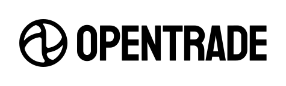
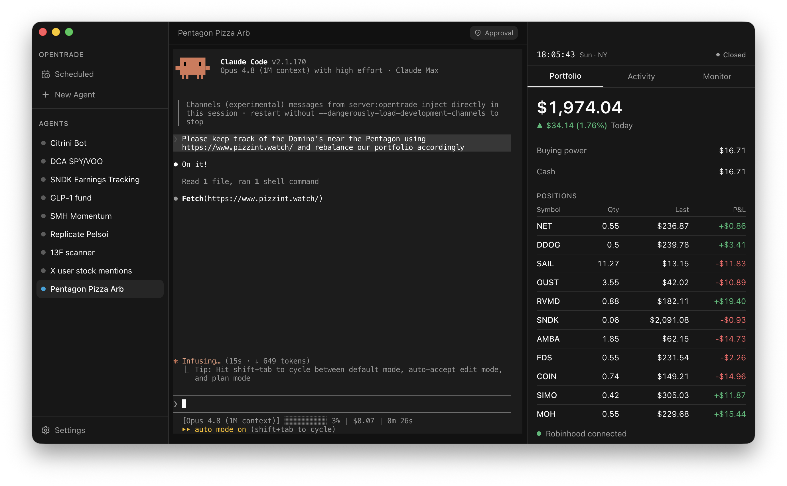

<div align="center">
  
  <p><strong>The open-source trading harness for Claude Code agents.</strong></p>
  
</div>

OpenTrade is a macOS app that enables agents to trade and react to the market autonomously. **Claude Code** agents execute trades in your [Robinhood Agentic Trading](https://robinhood.com/us/en/agentic-trading/) account through the official MCP. Set guardrails, monitors, and strategies so agents can trade 24/7 on *your machine*.

## Install

Download the latest `OpenTrade-<version>-arm64.dmg` from
[Releases](https://github.com/exla-ai/OpenTrade/releases), open it, and drag OpenTrade to
Applications. Requires an Apple Silicon Mac and the [`claude`](https://docs.claude.com/en/docs/claude-code)
CLI. The app auto-updates from GitHub Releases.

> **Note:** notarization is still pending, so on first launch macOS may block OpenTrade
> ("Apple could not verify…"). To approve it, open **System Settings → Privacy & Security**,
> scroll to the **Security** section, and click **Open Anyway** next to OpenTrade (or
> right-click the app in Applications and choose **Open**).

## Build from source

```bash
bun install                 # from repo root (bun workspaces)
bun run --cwd app rebuild   # rebuild native modules for the Electron ABI (once)
bun run --cwd app dev       # launch with HMR
```

## Disclaimer

OpenTrade is experimental software provided **as-is and without warranty of any kind**.
It is **not financial, investment, or trading advice**. The software runs autonomous
agents that can place and cancel real orders against a funded brokerage account; **you
are solely responsible for configuring, supervising, and bearing the financial
consequences of your agents.** Trading involves substantial risk of loss.

OpenTrade is an independent community project. It is **not affiliated with, endorsed by,
or sponsored by Robinhood Markets, Inc. or Anthropic.** "Robinhood," "Claude," and
"Claude Code" are trademarks of their respective owners. You are responsible for
complying with the terms of service of any broker or API you connect to.

## License

[Elastic License 2.0](LICENSE) — source-available. You may use, copy, modify, and
redistribute the software, but you may not provide it to third parties as a hosted or
managed service. See [LICENSE](LICENSE) and third-party attributions in [NOTICE](NOTICE).
